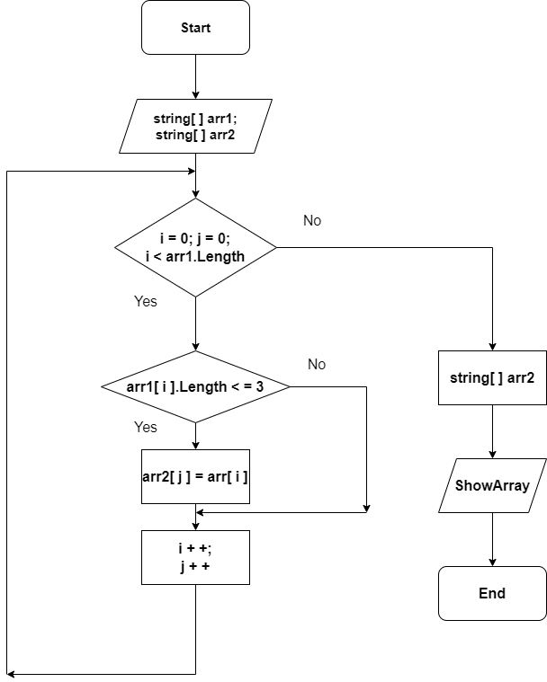

# Контрольная работа #

* __*Задача. Написать программу, которая из имеющегося массива строк формирует массив из строк, длина которых меньше либо равна 3 символа.
Первоначальный массив можно ввести с клавиатуры, либо задать на старте выполнения алгоритма. При решение не рекомендуется пользоваться коллекциями,
лучше обойтись исключительно массивами.*__

* __* Объявляется два массива: первый и второй одинаковой длины. Потом создается метод, в котором цикл осуществляет перебор элементов первого массива, внутри цикла проверяется условие ( <=3 ), если да, то элемент первого массива заносится в элемент второго массива с индексом j.  После присвоения увеличивается переменная j на 1 и возвращается к циклу for в котором i увеличивается на 1. И так проверяется до конца*__

## Блок схема алгоритма ##

* 
